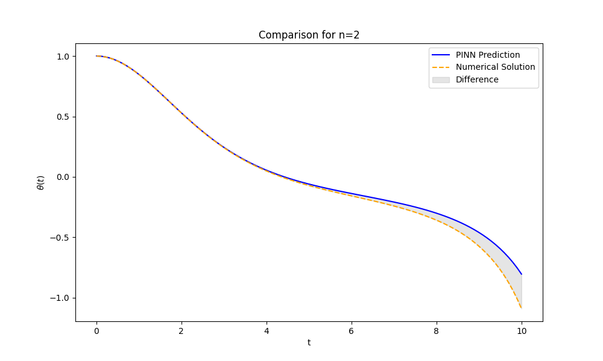

# Metrics Report for 30001 Epochs

**Number of Parameters**: 50049

This report summarizes the performance metrics of the PINN model compared to the numerical solutions for the Lane-Emden equation.

|   n |   Mean Absolute Difference |   Max Absolute Difference |   Mean Squared Error |
|----:|---------------------------:|--------------------------:|---------------------:|
|   0 |                0.00868792  |                0.016259   |          0.000109814 |
|   1 |                0.00196567  |                0.00309103 |          4.4458e-06  |
|   2 |                0.037604    |                0.286183   |          0.00492537  |
|   3 |                0.000927891 |                0.00179549 |          1.05428e-06 |
|   4 |                0.00268902  |                0.00620352 |          1.06479e-05 |
|   5 |                0.000579874 |                0.0015781  |          5.39034e-07 |

## Comparison with Analytical Solutions

|   n |   MSE (PINN vs Analytical) |   MSE (Numerical vs Analytical) |
|----:|---------------------------:|--------------------------------:|
|   0 |                0.000110681 |                     2.45578e-09 |
|   1 |                4.52242e-06 |                     1.76157e-08 |
|   5 |                3.48854e-07 |                     1.72743e-07 |

## Plots

## Combined Plot

